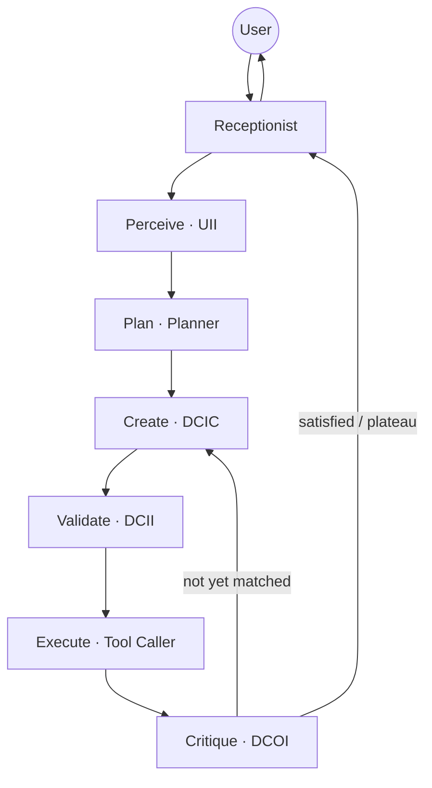
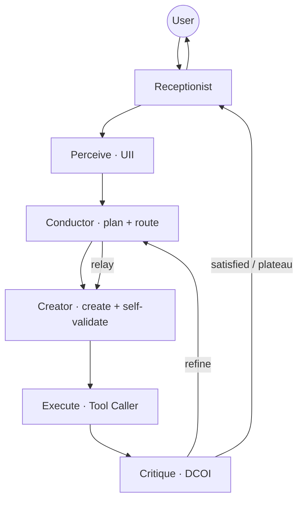
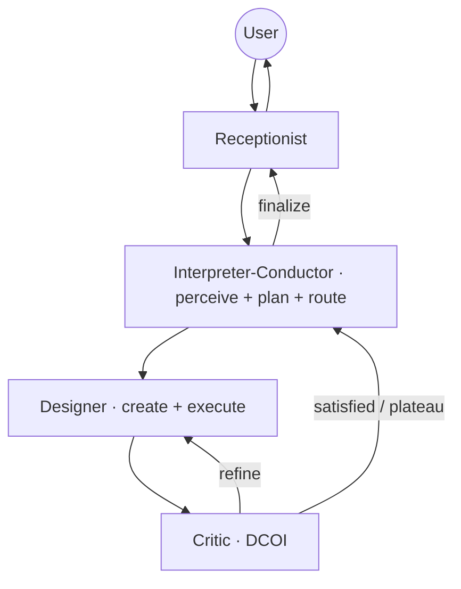

# Reduced-Agent Architectures — Design Rationale for the 5-Agent and 3-Agent Systems

**Status:** DESIGN / ARCHITECTURE — decisions locked; implementation deliberately out of scope (to be specified separately).
**Date:** 2026-07-26.
**Purpose:** Document, in full, *why* the propeller-design multi-agent system is being reduced from its 7-agent form into a 5-agent and a 3-agent variant for benchmarking — the goal, the reasoning method, every decision and its justification, the final architectures, and the caveats a reader (or a future implementer) must keep in mind.

This document is written to stand on its own. A reader who does not know the codebase can start at §2 (the baseline system) and follow through; a reader who knows it can skip to §4 (the reasoning).

---

## Table of contents

1. [Goal and scope](#1-goal-and-scope)
2. [Background: the baseline 7-agent system](#2-background-the-baseline-7-agent-system)
3. [The reasoning method](#3-the-reasoning-method)
4. [Design principles (the constraints we imposed)](#4-design-principles-the-constraints-we-imposed)
5. [Decision-by-decision reasoning](#5-decision-by-decision-reasoning)
6. [Why the 5-agent system merges the DC Input Creator with the DC Input Inspector](#6-why-the-5-agent-system-merges-the-dc-input-creator-with-the-dc-input-inspector)
7. [The three final architectures](#7-the-three-final-architectures)
8. [What each comparison step isolates](#8-what-each-comparison-step-isolates)
9. [Remarks and notes](#9-remarks-and-notes)
10. [Warnings — what to be wary of](#10-warnings--what-to-be-wary-of)
11. [Decision log (summary table)](#11-decision-log-summary-table)
12. [Out of scope / next steps](#12-out-of-scope--next-steps)

---

## 1. Goal and scope

### 1.1 The question we are trying to answer

The production system is a **7-agent pipeline plus a Receptionist** that turns a user's request (text and/or sketches of a propeller) into a concrete parameter set and a rendered 3-D geometry, iterating until the result matches the user's intent.

We want to know **how much of that agent structure is actually earning its keep.** Concretely: if we collapse the same capability into fewer, more general agents, does design quality hold, degrade gracefully, or collapse? And *where* does the value of decomposition live — in the strategist, the validators, the router, or the perception/critique specialists?

To answer this we build two reduced variants and benchmark all three head-to-head on the existing test suite (quantitative text, qualitative text, blade-counting, and the precision sketch-matching benchmarks):

* the **7-agent** system (the baseline / control),
* a **5-agent** system,
* a **3-agent** system.

### 1.2 Why 7 → 5 → 3, specifically

Three points, evenly spaced, give a *trend* rather than a single before/after contrast. More importantly, the three sizes are designed as **nested subsets** (see §3.3): the 5 is a strict collapse of the 7, and the 3 is a strict collapse of the 5. That nesting is what lets each step isolate a small number of variables instead of confounding many at once.

### 1.3 The invariant: the Receptionist is always kept

Every variant retains the Receptionist. This is deliberate and it is the experiment's **control surface**. The Receptionist does no design work — it is the front-of-house agent that fields the user's quick questions, forwards genuine design requests into the chain, and relays the chain's final answer back. Because it is byte-identical across all three configurations, any behavioural difference we observe is attributable to the **design chain**, not to how the system talks to the user. Removing or altering it would introduce a confound into every comparison for no analytical gain.

### 1.4 What is out of scope here

This document is about **architecture and rationale only.** It does **not** cover the implementation — the prompt merges, the routing rewire, or the config-selection mechanism. Those are non-trivial (see §10) and will be specified in a separate build plan. The value of settling the architecture first is that the implementation then has a fixed, justified target.

---

## 2. Background: the baseline 7-agent system

### 2.1 The eight functions

Every version of the system, regardless of agent count, must perform some subset of **eight functions**. Naming them explicitly is the backbone of the whole analysis, because the reduced systems are built by *re-clustering these functions*, not by inventing new behaviour.

| # | Function | What it means |
|---|----------|---------------|
| 1 | **Interface** | Talk to the user: field quick questions, forward design requests, deliver the final answer. |
| 2 | **Perceive** | Read the user's inputs — text *and* images/sketches — and turn them into a structured extraction (requirements, constraints, design intent). Requires vision. |
| 3 | **Plan** | Decide the strategy: what kind of job this is, what to prioritise, whether to iterate, and (at the end) whether the result is good enough to show the user. |
| 4 | **Route** | Decide which agent acts next; relay information between agents; keep the pipeline moving. |
| 5 | **Create** | Translate the (possibly qualitative) intent into the concrete numeric parameter set that defines the geometry. |
| 6 | **Validate** | Check that the created parameters are in range, self-consistent, and authorised — *before* anything is rendered. |
| 7 | **Execute** | Call the geometry/render tools and produce the mesh and its rendered views. Mechanical. |
| 8 | **Critique** | Look at the rendered output, judge it against the user's intent/sketch, and drive the refinement loop until it matches or provably cannot. Requires vision. |

The natural pipeline is: **perceive → plan → create → validate → execute → critique → (loop back) → deliver**, with interface at the front/back and routing threading through every hop.

### 2.2 The seven agents (plus the Receptionist)

In the baseline, each function is a dedicated agent — maximum specialisation. One function, one agent.

| Agent | Function it owns | Vision? | Notes |
|-------|------------------|:------:|-------|
| **Receptionist** | Interface | no | Front-of-house; forwards; never reasons about the design. **Kept in all variants.** |
| **Orchestrator** | Route | no | The dispatch hub. Every hand-off returns to it; it relays and decides the next hop. In the precision loop it relays critic feedback straight to the creator without re-planning. "Relays, does not deliberate." |
| **User Input Inspector (UII)** | Perceive | **yes** | Reads text + images; writes the extraction (quantitative / qualitative / design-intent sections); records sketch crop regions and warm-start shape estimates for precision jobs. |
| **Planner** | Plan | no | Chooses the strategy; issues the verbose **standing directive** that governs a precision job; is the **final approver** — nothing reaches the user without its stamp. |
| **DC Input Creator (DCIC)** | Create | no (by design) | Translates intent → the 16 parameters; writes `parameters.json`; under a precision directive nudges the shape parameters toward the critic's feedback. Deliberately image-blind. |
| **DC Input Inspector (DCII)** | Validate | no | Independent audit of the created parameters (ranges, consistency, authorisation); can bounce the design back to the creator. **Already toggleable** via the `DC_INSPECTOR_ENABLED` flag. |
| **Tool Caller** | Execute | no | Calls `generate_and_render_propeller` (geometry + renders); passes the render paths on. The most mechanical agent. |
| **DC Output Inspector (DCOI)** | Critique | **yes** | Compares the render to the intent/sketch; judges *satisfied* / *plateau*; drives the tight refine loop. The engine behind the precision sketch-matching capability. |

Two further agents exist but are **not part of the design chain** and are irrelevant to this analysis: the **Database Handler** (runs post-session) and the **Context Pruner** (an in-process utility other agents call). Neither is counted among the "7".

### 2.3 Two structural facts that shape the reductions

* **There are two independent "checker" agents.** The DCII checks the *input* (parameters, before rendering); the DCOI checks the *output* (the render, after). The 7-agent design's philosophy is *separate the doers from the checkers*.
* **The critique loop is the system's most load-bearing mechanism.** The precision sketch-matching feature (benchmarks 6 and 7) is built entirely on the DCOI driving iterative refinement. Anything that weakens or removes critique changes what the system can fundamentally *do*, not merely how it is organised.

---

## 3. The reasoning method

We did not choose agents to delete by intuition. We used a small set of explicit reasoning moves, in order.

### 3.1 Function-first decomposition

Start from the eight functions (§2.1), not from the agents. Ask *"which functions must survive, and how few agents can carry them?"* rather than *"which agent can we drop?"* This keeps the reductions honest: a smaller system is defined by how it **clusters functions**, so we can always say exactly what each agent is responsible for.

### 3.2 Merge, don't delete — for the fair-comparison variant

There are two fundamentally different ways to shrink the system:

* **Merge** — preserve every function, but give one agent several of them. The system can still do everything; only the *granularity* of specialisation changes.
* **Prune** — remove a function entirely. The system can no longer do something.

A merge-only reduction is the **fair fight**: it holds capability constant and varies only decomposition, so a score difference means "coordination/specialisation overhead," not "this system literally cannot perform the task." A pruned reduction answers a different, blunter question: "is this stage worth having at all?"

Both questions are interesting, which is why (see §5.3) we made the 5-agent a merge-only system and the 3-agent a genuine strip-down — **one of each**.

### 3.3 Nesting (controlled subsets)

Rather than three unrelated architectures, we require each smaller system to be a **strict collapse of the next larger one**: 7 ⊃ 5 ⊃ 3. This is the single most important methodological choice, because it turns the benchmark from "three different systems performed differently" into a **controlled experiment**: each step (7→5, 5→3) changes only a small, named set of things, so a performance change can be attributed to those things.

### 3.4 The experimental-control lens

When a reduction offers a choice of *which* functions to merge (and it usually does), pick the merge by **what the resulting comparison lets you measure**, not by what is merely convenient or elegant in isolation. §6 is the worked example of this lens deciding a genuinely close call.

### 3.5 Protect the load-bearing capability

Never merge a function whose *independence* is the whole point. The clearest case: **critique.** A generator grading its own output is a structurally weak loop (self-review bias). So the critic (DCOI) stays a distinct agent in every configuration, even the 3-agent — it is the one merge we refuse.

### 3.6 Leverage existing seams

Where two candidate merges are otherwise comparable, prefer the one that maps onto a seam the codebase already has (an existing toggle, an existing hand-back edge). It is cheaper and lower-risk, and — importantly for a benchmark — less likely to introduce an unintended capability change that would contaminate the comparison. The DCII's existing `DC_INSPECTOR_ENABLED` flag is exactly such a seam (see §6).

---

## 4. Design principles (the constraints we imposed)

These are the fixed rules the two reduced designs had to satisfy. Each follows from the method in §3.

| # | Principle | Rationale |
|---|-----------|-----------|
| P1 | **The Receptionist is always present and unchanged.** | It is the experiment's control surface; it does no design work (§1.3). |
| P2 | **The critique/refine loop survives in every configuration.** | It is the engine of the precision benchmarks; removing it makes benchmarks 6/7 non-comparable across configs, and self-critique is a weak substitute (§3.5). |
| P3 | **The 5-agent is merge-only; the 3-agent is a strip-down.** | "One of each": the 5 measures decomposition granularity at constant capability; the 3 measures whether a whole stage is worth having (§3.2). |
| P4 | **Each smaller system is a strict subset of the larger (7 ⊃ 5 ⊃ 3).** | Controlled, one-variable-at-a-time comparison (§3.3). |
| P5 | **The routing/planning "hub" is the Orchestrator fused into the Planner** in the reduced configs. | A near-linear reduced pipeline does not need a separate reasoning agent purely for routing; folding routing into the strategist frees an agent slot for real work (§5.4). *(This was the user's explicit steer.)* |
| P6 | **Merges are chosen for what the comparison isolates**, not convenience. | The experimental-control lens (§3.4, §6). |

---

## 5. Decision-by-decision reasoning

Each subsection is one decision: the question, the options, the reasoning, and the outcome.

### 5.1 Keep the Receptionist in every configuration

* **Question:** Should the interface agent count toward the reduction budget?
* **Reasoning:** The Receptionist performs no design reasoning, so removing it would test nothing about the *design* pipeline while adding a confound (a different front-end) to every comparison. Keeping it identical makes it a control.
* **Outcome:** Receptionist is a fixed, unchanged fixture in all three systems. The counts "7 / 5 / 3" refer to the **design-chain agents**; the Receptionist is additional in all three.

### 5.2 Keep the critique loop everywhere

* **Question:** Can the critic (DCOI) be merged away in the leanest system?
* **Options:** (a) keep it standalone everywhere; (b) let it merge into the designer at 3 (self-critique); (c) drop iteration entirely at 3.
* **Reasoning:** (b) is a self-grading loop — the same agent that produced the render judges it, which is exactly the bias the two-agent generator↔critic split exists to avoid. (c) turns the 3-agent into a fundamentally different (non-iterative) system and makes the precision benchmarks incomparable. Only (a) preserves the capability being measured and keeps the benchmarks comparable.
* **Outcome:** The critic stays its own agent in all three configs. It is the one function we never merge.

### 5.3 Merge-only for the 5, strip-down for the 3

* **Question:** Should the smaller systems preserve all functions (merge) or remove some (prune)?
* **Reasoning:** Both questions are worth answering. A merge-only 5-agent gives a clean read on *decomposition overhead* at constant capability; a pruned 3-agent gives a clean read on *whether a stage is worth having.* Doing "one of each" gets both, and — combined with nesting — the 3-agent's single dropped stage becomes a crisp third data point.
* **Outcome:** 5-agent = merge-only (every function still performed, by fewer agents). 3-agent = strip-down (exactly one function removed — see §5.6).

### 5.4 Fuse the Orchestrator into the Planner (the "Conductor")

* **Question:** In the reduced systems, should routing remain a dedicated LLM agent, or be absorbed?
* **Reasoning:** The dispatch **loop** is already code; the Orchestrator's *LLM* value is in non-linear routing (recovery, relay, precision-loop relay). In a reduced, near-linear pipeline those decisions are far simpler, and a strategist that already decides "what should happen next" is the natural owner of "who acts next." Fusing routing into the Planner yields a single **Conductor** that plans, routes, relays, and approves — and frees a scarce agent slot for genuine design work. *(This direction was the user's explicit preference: "make it kinda joined with the Planner.")*
* **Outcome:** In both reduced configs the Orchestrator is not a separate agent; its routing role lives inside the Planner-derived Conductor. The 7-agent baseline keeps them separate (it is the unchanged production system).
* **Consequence (flagged for implementation, not resolved here):** this makes the *Planner* the dispatch hub — hand-offs return to it rather than to a standalone Orchestrator. See W2/W3 in §10.

### 5.5 The 5-agent's second merge — DCIC + DCII

This is the decision the reader specifically asked to have justified. It has its own section: **§6.** In brief: after fusing Orchestrator→Planner (−1 agent), the 5-agent needs one more merge to reach five. We merge **Create + Validate** into a single self-validating **Creator**, rather than the alternative of merging **Validate + Execute**. The full argument — and why it beats the alternative — is §6.

### 5.6 The 3-agent's structure and its dropped stage

* **Question:** Starting from the 5-agent, which two further merges (and which single drop) produce the 3-agent?
* **Reasoning:** From the 5-agent (`Conductor · UII · Creator · Tool Caller · Critic`):
  * Fold **perceive (UII)** into the Conductor → an **Interpreter-Conductor** that reads the drawings *and* forms the plan *and* routes. Perception and planning are tightly coupled — you plan in light of what you read — so this is a natural fusion.
  * Fold **execute (Tool Caller)** into the Creator → a **Designer** that writes parameters *and* renders them. The Tool Caller is the most mechanical role; absorbing it costs little conceptually.
  * **Drop validation entirely.** With critique protected (P2) and perceive/create/execute all essential, the only droppable stage is **validation.** This is the strip-down: the Designer writes parameters and renders with *no dedicated check* — the tool's own range guards plus the reactive critique loop are the only safety net.
* **Outcome:** 3-agent = **Interpreter-Conductor · Designer · Critic** (plus Receptionist). This is the classic **brain / hands / eyes** triad: interpret-and-plan, make-and-render, judge-and-loop.

### 5.7 The nesting property (verification)

Confirm 7 ⊃ 5 ⊃ 3:

* **7 → 5:** merge Orchestrator into Planner (Conductor); merge DCII into DCIC (Creator). Tool Caller and DCOI unchanged. *(−2 agents.)*
* **5 → 3:** merge UII into the Conductor (Interpreter-Conductor); merge Tool Caller into the Creator (Designer); drop the (now self-) validation. DCOI unchanged (Critic). *(−2 agents.)*

Every reduced agent is a union of baseline agents; nothing is invented. The nesting holds.

---

## 6. Why the 5-agent system merges the DC Input Creator with the DC Input Inspector

This section justifies the §5.5 decision in full, because it was a genuinely close call decided by the experimental-control lens (§3.4).

### 6.1 The two candidates

After the Orchestrator→Planner fusion, one more merge is needed. Because the pipeline order is `create → validate → execute`, only adjacent pairs merge cleanly:

* **Option A — merge Create + Validate** → a **Creator** that writes parameters and self-validates them. Tool Caller stays standalone. *(This is the chosen option.)*
* **Option B — merge Validate + Execute** → a **Builder** that validates the incoming parameters and then renders them. DCIC stays standalone.

Both preserve all functions (both are valid merge-only reductions). The difference is subtle and important.

### 6.2 The honest case *for* Option B

Option B has a real, non-trivial merit that must be acknowledged: it **keeps the parameter check independent of the creator.** Independence is the DCII's entire reason to exist. Under Option A the creator validates its own work — self-review, with correlated blind spots. (The production run analysed as "run 2" is the cautionary tale: a creator that had frozen the blade chords "believed" it was right; a self-check would very likely have waved that through, whereas an independent inspector at least *could* catch it — and in that run the independent DCII did catch a related chord issue.) Option B is also geometrically clean (validate and execute are already adjacent) and reads as a coherent *propose → vet-and-build → judge* pipeline. On the merits *in isolation*, Option B is arguably the more principled 5-agent.

### 6.3 The deciding factor — what the three-config sweep isolates

The nesting (§3.3) means the choice is not local: it determines what the **whole 7→5→3 sweep** measures on the validation axis.

| | Validation at 7 | at 5 | at 3 | Resulting gradient |
|---|---|---|---|---|
| **Option A** (DCIC + DCII) | independent | **self-check** | none | independent → self → none — a **clean three-step gradient** |
| **Option B** (DCII + Tool Caller) | independent | independent (bundled with render) | none | independent → independent → none — **5 ≈ 7 on validation** |

* **Option A** turns the entire sweep into a controlled experiment on validation: *how much input-checking do you actually need?* Each configuration is a distinct regime, and the benchmark can quantify what self-validation recovers versus an independent inspector, and what dropping it entirely costs.
* **Option B** holds validation essentially constant across the 7 and the 5, so the 7→5 step instead isolates *"is a standalone execution agent worth it?"* — and the Tool Caller is the most mechanical role in the system, so that variable is the one **least likely** to move results. Option B would spend its single isolated 7→5 variable on a probably-null finding.

Because validation is the more contested and more interesting question — and because Option A yields a clean, publishable gradient (independent → self → none) that lines up perfectly with the 3-agent's dropped stage — Option A is the stronger experimental design.

### 6.4 The secondary trade-offs (all also favour Option A)

* **Build cost.** Option A maps exactly onto the existing `DC_INSPECTOR_ENABLED = off` path (when the inspector is disabled, the creator forwards straight to the Tool Caller and the range-checking burden already falls on the creator). It is therefore nearly free and low-risk. Option B is genuinely new wiring — a merged agent that does not exist today.
* **Model sizing.** Option B fuses a *reasoning* check (DCII) with a *mechanical* call (Tool Caller); you would size the merged agent's model for the harder job (validation), making the cheap "execute" part more expensive than it needs to be. Option A leaves the Tool Caller as a thin, cheap agent.
* **Overstep risk.** An Option-B Builder holds the render tool *and* judges the parameters, so it may be tempted to "just fix it and render" — quietly absorbing the creator's role. Option A has no such new failure mode.

### 6.5 The one condition under which Option B would win

For completeness: Option B would be the right choice **if the priority were to make the 5-agent maximally faithful to the 7's doer/checker separation** — i.e. if independent validation were considered valuable enough that the 5-agent should retain it, spending the 3-agent as the sole "no validation" data point. That is a legitimate research stance. It was weighed and **not** chosen: the clean validation gradient and the near-free, low-contamination build were judged the greater value.

### 6.6 Outcome

**Option A — merge DCIC + DCII into a self-validating Creator.** The 5-agent's three configurations then form the controlled validation gradient **independent (7) → self-check (5) → none (3)**, which is itself a headline result the benchmark is designed to produce.

---

## 7. The three final architectures

### 7.1 Function-to-agent map

Rows are the eight functions in pipeline order; brackets show where a merge fuses adjacent functions into one agent.

| Function | 7-agent (baseline) | 5-agent (merge-only) | 3-agent (strip-down) |
|----------|--------------------|----------------------|----------------------|
| **interface** | Receptionist | Receptionist | Receptionist |
| **perceive** | User Input Inspector | User Input Inspector | ┐ **Interpreter-** |
| **plan** | Planner | ┐ **Conductor** | │ **Conductor** |
| **route** | Orchestrator | ┘ | ┘ |
| **create** | DC Input Creator | ┐ **Creator** | ┐ **Designer** |
| **validate** | DC Input Inspector | ┘ *(self-check)* | ✕ *dropped* │ |
| **execute** | Tool Caller | Tool Caller | ┘ |
| **critique** | DC Output Inspector | DC Output Inspector | **Critic** |
| *count (chain)* | **7** | **5** | **3** |

### 7.2 The 7-agent baseline (unchanged production system)

`Receptionist · Orchestrator · UII · Planner · DCIC · DCII · Tool Caller · DCOI`
One agent per function; maximum specialisation; the reference point.

*(Routing physically passes through the Orchestrator between every step; it is omitted from the diagram for readability. The Planner is the final approver on the return path.)*

### 7.3 The 5-agent system (merge-only)

`Receptionist · Conductor · UII · Creator · Tool Caller · DCOI`

* **Conductor** = Planner + Orchestrator (plan · route · relay · approve).
* **Creator** = DC Input Creator + DC Input Inspector (create · self-validate).
* Tool Caller and DCOI unchanged.

### 7.4 The 3-agent system (strip-down)

> **⚠ SUPERSEDED (2026-08-04) — the refine loop below is out of date.**
> The diagram shows `Cri -->|refine| Des` (always direct) while W3 in §9
> says the relay goes `Critic -> Interpreter-Conductor -> Designer`
> (always through the brain).  Those contradict each other, and the system
> as built does NEITHER: the Critic refines directly with the Designer,
> and the Architect is called on escalation, on phase change, and on a
> dispatcher-enforced checkpoint.  See
> `design_3agent_architecture.md` §4, which is authoritative.  The brain is
> named **Architect**, not "Interpreter-Conductor".

`Receptionist · Interpreter-Conductor · Designer · Critic`

* **Interpreter-Conductor** = UII + Planner + Orchestrator (perceive · plan · route · approve).
* **Designer** = DC Input Creator + Tool Caller (create · execute). **No validation stage.**
* **Critic** = DC Output Inspector (critique · drive refinement).

The brain / hands / eyes triad: **interpret-and-plan → make-and-render → judge-and-loop.**

---

## 8. What each comparison step isolates

Because of the nesting, each step changes a small, named set of things:

* **7 → 5** removes the *dedicated LLM router* (folded into the Planner) and the *independent parameter auditor* (folded into the Creator as self-validation). It answers: **does an independent input-validation stage, plus a routing agent, beat a self-checking creator plus a planning-conductor?**
* **5 → 3** fuses *perception into the planning brain*, fuses *execution into the creator*, and *drops validation entirely*. It answers: **does separating perception from planning, having a standalone renderer, and keeping any validation gate at all, actually contribute — or is the minimal brain/hands/eyes triad enough?**

The cleanest single result the design is built to produce is the **validation gradient**: with input-checking going *independent (7) → self-check (5) → none (3)*, the benchmark can quantify what self-validation recovers of the independent inspector's value, and what removing validation altogether costs.

---

## 9. Remarks and notes

* **R1 — The nesting enables incremental build.** Because 7 ⊃ 5 ⊃ 3, the systems can be built and validated in order, each a further collapse of the last, rather than as three separate codebases.
* **R2 — The 5-agent's validation merge is nearly free.** It reuses the existing `DC_INSPECTOR_ENABLED = off` path; no genuinely new agent is required for that step (§6.4).
* **R3 — Critique preserved ⇒ precision benchmarks stay comparable.** Keeping the DCOI as a distinct agent everywhere is what makes benchmarks 6 and 7 (precision sketch-matching) meaningful across all three configs.
* **R4 — The validation gradient is itself a finding**, not just a design nicety — it is arguably the most reportable outcome of the whole sweep (§6.3, §8).
* **R5 — Other decompositions exist and were not chosen.** One could define a 4- or 6-agent point, or different merges at each size. The 7/5/3 nesting was chosen because it yields clean, controlled, one-variable-per-step comparisons; ad-hoc intermediate sizes would trade that away.
* **R6 — Vision is concentrated as agents shrink.** Perception (UII) and critique (DCOI) are the two vision-dependent functions. They stay separate in the 7 and 5; in the 3-agent, perception moves *into* the Interpreter-Conductor, so that agent becomes vision-capable while the Critic remains the other vision user. This concentration is worth watching (see W1).

---

## 10. Warnings — what to be wary of

These are the caveats a reader interpreting the benchmark — or an engineer implementing the variants — must keep in front of them.

* **W1 — The cognitive-load confound (most important for interpretation).** As agents merge, the surviving agents each juggle more. The 3-agent's Interpreter-Conductor perceives, plans, routes, approves, *and* reads images — a heavy load. Prior production analysis showed that even strong models degrade when one agent juggles too much. **Therefore, if the 3-agent scores worse, the benchmark cannot by itself tell you whether that is "fewer agents" or "one overloaded agent."** Control for this deliberately — e.g. give the merged brain agent a stronger model, and/or measure per-function quality — or the comparison conflates two different effects.

* **W2 — The routing rewire is a real architectural change.** Fusing the Orchestrator into the Planner makes the *Planner* the dispatch hub. Today the dispatch loop returns control to a standalone Orchestrator; in the reduced configs every hand-off must return to the Conductor instead. This is not a cosmetic relabel — it re-points the hub of the whole pipeline.

* **W3 — The precision machinery is written around the 7-agent set.** The standing-directive propagation, the refine-round cap, and the critic→creator relay (currently DCOI → Orchestrator → DCIC, with no re-plan per round) all assume the specific 7-agent topology. Each must be re-mapped onto the reduced sets — e.g. in the 3-agent the relay becomes Critic → Interpreter-Conductor → Designer. If this is done carelessly, the precision benchmarks will behave differently for reasons unrelated to agent count.

* **W4 — Self-validation has correlated blind spots (5-agent).** The 5-agent's Creator checks its own parameters. Do **not** expect this to match the 7-agent's independent inspector: an agent that made an error is poorly placed to catch it. This is by design (it is the very thing the validation gradient measures), but it must not be mistaken for a bug when the 5-agent misses something the 7-agent caught.

* **W5 — The 3-agent has no validation gate.** Out-of-range or inconsistent parameters are caught only reactively — by the render tool's own guards or by the critique loop after a bad render — not proactively before rendering. Expect more render-time errors and more reactive recovery cycles in the 3-agent. That is the intended character of the strip-down, not a defect.

* **W6 — Concentration of authority in the Conductor.** The Planner is already the *final approver*. Fusing routing into it (5 and 3) and perception too (3) means one agent perceives, plans, routes, *and* signs off. Watch for it approving its own routing/planning decisions without genuine scrutiny — the check-and-balance that a separate Orchestrator/UII provided is gone.

* **W7 — Model-sizing asymmetry in merged agents.** A merged agent inherits the model tier of its hardest sub-task. A Designer (create + execute) sized for creation makes the mechanical rendering call run on an unnecessarily expensive model. This affects cost and latency comparisons, not correctness — but it means "the 3-agent is cheaper" is not automatic and must be measured, not assumed.

* **W8 — Keep the comparison fair.** The merged prompts must preserve each source agent's discipline **without adding or removing capability** beyond the intended merge. If a merged prompt accidentally teaches the agent something the baseline never knew (or drops a rule the baseline had), the benchmark measures a prompt difference, not an architecture difference. Hold models, temperatures, tool sets, and settings constant across configs except for the topology itself.

* **W9 — "Fewer agents" is not automatically "cheaper" or "faster."** Merging can reduce inter-agent hops (fewer full-context re-sends) but can also lengthen individual turns and push work onto pricier models (W7). The net cost/latency effect is an empirical question the benchmark should answer, not an assumption baked into the design.

---

## 11. Decision log (summary table)

| # | Decision | Chosen | Rationale (short) |
|---|----------|--------|-------------------|
| D1 | Keep the Receptionist in all variants | Yes | Control surface; no design work (§5.1). |
| D2 | Keep the critique loop in all variants | Yes | Load-bearing; self-critique is weak; keeps precision benchmarks comparable (§5.2, P2). |
| D3 | 5-agent philosophy | Merge-only | Fair comparison at constant capability (§5.3). |
| D4 | 3-agent philosophy | Strip-down | Tests whether a whole stage is worth having (§5.3). |
| D5 | Nesting 7 ⊃ 5 ⊃ 3 | Required | One-variable-per-step controlled comparison (§3.3, §5.7). |
| D6 | Routing hub in reduced configs | Fuse Orchestrator into Planner ("Conductor") | Routing is simple in a lean pipeline; frees a slot; user's steer (§5.4, P5). |
| D7 | 5-agent's second merge | **DCIC + DCII** (self-validating Creator) | Yields the clean validation gradient; near-free build; the alternative isolates a probably-null variable (§6). |
| D8 | 3-agent merges | UII→Conductor; Tool Caller→Creator | Perception couples to planning; execution is mechanical (§5.6). |
| D9 | 3-agent dropped stage | Validation | Only droppable stage given P2 and essential perceive/create/execute (§5.6). |

---

## 12. Out of scope / next steps

This document fixes the **architecture and its justification**. It deliberately does **not** specify:

* the **config-selection mechanism** (the intended shape is a single `SYSTEM_TOPOLOGY = 7 | 5 | 3` setting that selects which agents are built and how the dispatcher wires them — one codebase, no forks, the way `DC_INSPECTOR_ENABLED` already toggles one agent);
* the **prompt merges** (how the Conductor's prompt is assembled from Planner + Orchestrator, the Creator's from DCIC + DCII, and so on, preserving each source's discipline per W8);
* the **routing rewire** (making the Planner the hub, and re-pointing the precision machinery per W2/W3).

These constitute the **build plan**, to be written separately once this architecture is agreed. The warnings in §10 are the checklist that build plan must answer.
